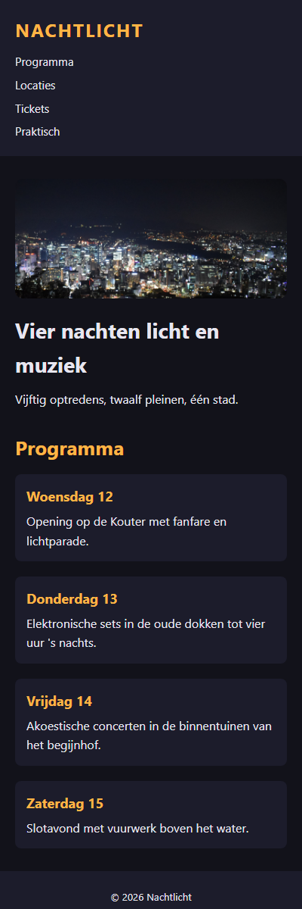
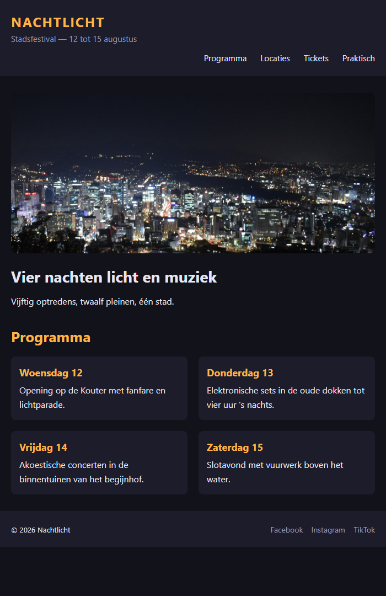
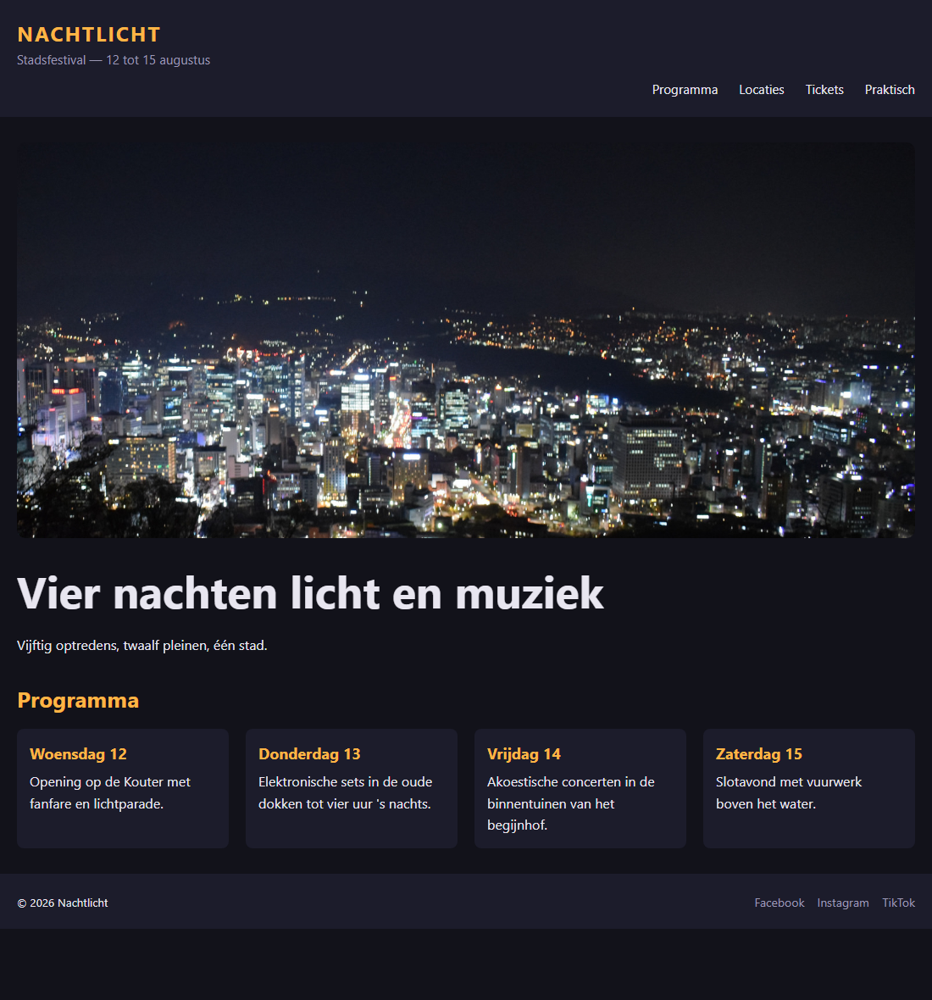

## Herhaling 4 — CSS responsive

**Richttijd: 22 minuten.**

De site van stadsfestival *Nachtlicht* ziet er prima uit op een breed scherm, maar op een smartphone loopt alles mis: de pagina is breder dan het scherm en de tekst is onleesbaar. Maak de site responsive.

De HTML pas je **niet** aan. Werk **mobile first**: de basisregels gelden voor het kleinste scherm, en met media queries maak je de pagina stap voor stap breder. Er zijn **twee** breakpoints nodig: `600px` en `900px`.

## Opdracht

**Flexibel maken** (buiten de media queries)

1. **.wrapper** — de vaste breedte van `1100px` mag de pagina nooit doen uitsteken. Maak ze flexibel, maar nooit breder dan `1100px`.
2. **img** — de vaste breedte van `1060px` moet weg. Maak de afbeelding flexibel: nooit breder dan de plaats die ze krijgt, met behoud van de verhoudingen.
3. **.menu** — zet de menu-items standaard **onder elkaar**, met `5px` ertussen.
4. **h1** — standaard `28px`.
5. **.tagline** — standaard **verborgen**.
6. **.programma** — standaard **één kolom**.
7. **.footer__inner** — copyright en sociale links staan standaard **onder elkaar**, gecentreerd, met `10px` ertussen.

**Media queries** (onderaan de stylesheet, van klein naar groot)

8. **Vanaf 600px:**
   - de tagline wordt weer zichtbaar
   - het menu staat weer naast elkaar, rechts uitgelijnd, met `25px` ertussen
   - het programma toont **twee** kolommen
   - copyright en sociale links staan weer naast elkaar, met de vrije ruimte ertussen
9. **Vanaf 900px:**
   - de `h1` wordt `52px`
   - het programma toont **vier** kolommen

## Aandachtspunten

- Gebruik enkel `min-width`-queries (`@media (width >= ...)`), nooit `max-width`.
- Zet alle media queries onderaan de stylesheet, gesorteerd van klein naar groot.
- Zet **alleen wat verandert** in een media query — properties die op elke breedte gelijk blijven, horen in de gewone regel.
- Vergeet niet dat een echte pagina ook de viewport-metatag nodig heeft in de `<head>`.

## Screenshots

Op een smal scherm (400px):

Vanaf 600px:

Vanaf 900px:

